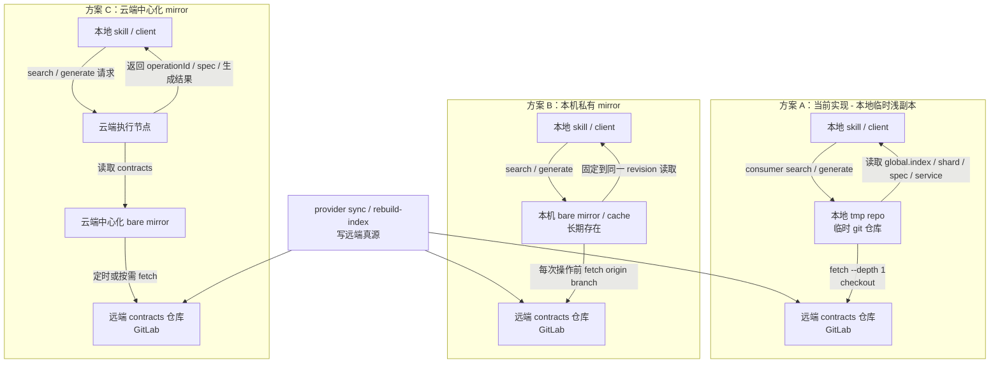

# API Contract Skill 读取方案对比图

更新时间：2026-03-18

本文只讨论 contracts **读取路径**，不展开权限隔离、索引优化和写入链路细节。

## 1. 三种读取方案对比



## 2. 当前方案的真实行为

当前实现不是“直接 SSH 实时读远端文件”，而是：

1. 本地创建一个临时 git 仓库
2. 从远端做一次浅 fetch
3. checkout 到本地
4. 再读取本地文件

所以当前真正的问题，不是“有没有副本”，而是“每次都在重复创建短命副本”。

## 3. 为什么 mirror 里的内容仍然有意义

mirror 里的内容本质上仍然是远端仓库内容，但它改变了读取方式：

- 多个文件读取可以固定到同一个 revision
- 多次查询不需要每次都重复建临时 repo
- 远端压力从“每次查询都要参与”变成“按需或按周期同步一次”

所以 mirror 的价值不在“内容不同”，而在“读取成本结构不同”。

## 4. 什么时候值得上 mirror

### 高频多人

更适合上 mirror，原因：

- 查询频率高
- 多次读取可摊薄同步成本
- 更需要稳定和一致的 revision 视图

### 中频少人

不一定一上来就值得做重型的“云端中心化 mirror + 查询服务”。

更合理的第一步通常是：

- 先停止“每次临时 shallow clone”
- 改成长期存在的本机缓存或云端单节点 bare cache

## 5. 当前建议

结合当前仓库现状和讨论结论：

- 当前实现属于：**方案 A，本地临时浅副本**
- 如果只是中频少人：优先考虑 **轻量持久缓存**，不要一开始就做重型平台化
- 如果未来变成高频多人：再演进到 **方案 C，云端中心化 mirror**

一句话总结：

> 当前方案的问题不是“没有副本”，而是“副本太短命且每次重建”；mirror 方案的意义是把副本变成可复用的长期读取平面。

## 6. 分层结构图（ASCII 版）

### 方案 A：当前实现，本地临时浅副本

```text
┌──────────────────────────────────────────────────────────────────────────┐
│                              本地执行层                                  │
│    ┌──────────────────────┐      ┌──────────────────────────────────┐   │
│    │   skill / client     │─────▶│  本地 tmp repo                   │   │
│    │  search / generate   │      │  临时 git 仓库                   │   │
│    └──────────────────────┘      └──────────────────────────────────┘   │
└──────────────────────────────────────────────────────────────────────────┘
                                      │
                                      │ fetch --depth 1 + checkout
                                      ▼
┌──────────────────────────────────────────────────────────────────────────┐
│                           远端真源仓库层                                 │
│      git@gitlab.dstcar.com:dmp/ai-coding/dst-api-skills-repo.git       │
│      - services/<service>/SERVICE.yaml                                  │
│      - controllers/*/*.spec.yaml                                        │
│      - controllers/*/*.doc.md                                           │
│      - indexes/global.index.json                                        │
│      - indexes/services/<service>/*                                     │
└──────────────────────────────────────────────────────────────────────────┘

特点：
- 每次 search / generate 都会重复创建并使用短命副本
- 本地会产生 tmp 仓库
- 远端参与每一次读取链路
```

### 方案 B：本机私有 mirror

```text
┌──────────────────────────────────────────────────────────────────────────┐
│                              本地执行层                                  │
│    ┌──────────────────────┐      ┌──────────────────────────────────┐   │
│    │   skill / client     │─────▶│  本机 bare mirror / cache        │   │
│    │  search / generate   │      │  长期存在，只读查询               │   │
│    └──────────────────────┘      └──────────────────────────────────┘   │
└──────────────────────────────────────────────────────────────────────────┘
                                      │
                                      │ 每次操作前 fetch origin branch
                                      ▼
┌──────────────────────────────────────────────────────────────────────────┐
│                           远端真源仓库层                                 │
│      git@gitlab.dstcar.com:dmp/ai-coding/dst-api-skills-repo.git       │
└──────────────────────────────────────────────────────────────────────────┘

特点：
- 本地不再反复创建 tmp repo
- 每台机器维护一份自己的长期缓存
- 一次操作内可固定到同一 revision
```

### 方案 C：云端中心化 mirror

```text
┌──────────────────────────────────────────────────────────────────────────┐
│                              客户端层                                    │
│                     ┌──────────────────────────────┐                     │
│                     │      本地 skill / client     │                     │
│                     │   只发 search / generate 请求 │                     │
│                     └──────────────┬───────────────┘                     │
└────────────────────────────────────┼─────────────────────────────────────┘
                                     │
                                     ▼
┌──────────────────────────────────────────────────────────────────────────┐
│                            云端执行层                                    │
│      ┌──────────────────────────┐      ┌────────────────────────────┐    │
│      │  云端 search/generate    │─────▶│  云端中心化 bare mirror    │    │
│      │      worker / service    │      │  长期存在，集中复用         │    │
│      └──────────────────────────┘      └────────────────────────────┘    │
└──────────────────────────────────────────────────────────────────────────┘
                                     │
                                     │ 定时或按需 fetch
                                     ▼
┌──────────────────────────────────────────────────────────────────────────┐
│                           远端真源仓库层                                 │
│      git@gitlab.dstcar.com:dmp/ai-coding/dst-api-skills-repo.git       │
└──────────────────────────────────────────────────────────────────────────┘

特点：
- 你的本地不落任何 tmp 副本
- 查询压力集中到云端执行节点
- 更适合后续继续做服务化、审计和权限隔离
```
