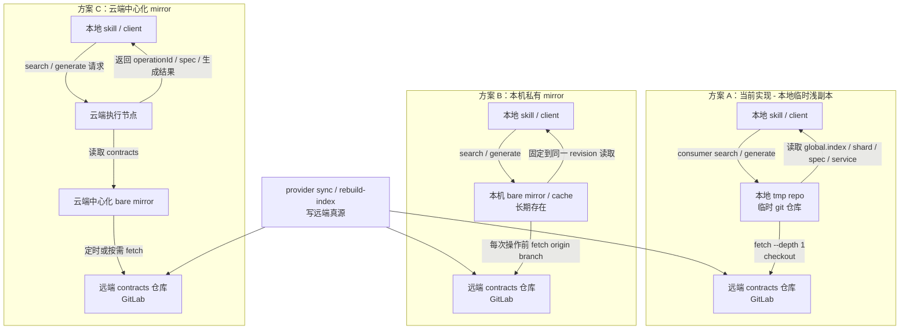

# API Contract Skill 链路说明

更新时间：2026-03-19

## 1. 当前系统里有哪几个角色

当前一共有 4 个核心角色：

1. `skill 仓库`
作用：
- 存规则
- 存模板
- 存脚本实现
- 真正执行 `provider sync / provider delete-controller / consumer search / consumer generate / contracts rebuild-index`

当前目录：
- `/Users/luohao/.codex/skills/api-contract-client-workflow`

2. `provider 项目`
作用：
- 提供 Spring Controller / DTO / VO / 相关源码
- 被扫描后生成 contracts 真源

3. `contracts 仓库`
作用：
- 保存统一远端真源
- provider 同步进去
- consumer 从这里检索

当前固定仓库：
- `git@gitlab.dstcar.com:dmp/ai-coding/dst-api-skills-repo.git`

4. `consumer 项目`
作用：
- 本地 Java 项目
- skill 最终把 Feign/DTO 代码写到这里

关键点：
- consumer 结构不存到远端 contracts
- 只在生成时于本地识别

## 2. 什么是真源，什么不是

### 真源

1. `SERVICE.yaml`
作用：
- service 级事实源
- 记录 identity / owner / source / target / pathRules

2. `Controller.spec.yaml`
作用：
- controller 级接口事实源
- 记录 controller / methods / request / response / schemas / errors / source

### 派生产物

1. `Controller.doc.md`
作用：
- 阅读对象
- 从 `SERVICE + Spec` 渲染生成

2. `indexes/`
作用：
- 检索对象
- 给 `consumer search` 使用

结论：
- 真相只认 `SERVICE.yaml + Controller.spec.yaml`
- `doc` 和 `index` 不允许反向当真源

## 3. contracts 仓库当前结构是什么

当前代码和 README 的真实结构仍然是：

```text
repo-root/
  services/
    <service>/
      SERVICE.yaml
      controllers/
        <Controller>/
          <Controller>.spec.yaml
          <Controller>.doc.md
  indexes/
    global.index.json
    services/
      <service>/
        manifest.json
        operations.jsonl
        inverted/
          <bucket>.json
```

注意：
- 当前不是 split global
- `indexes/global/registry.json` 和 `indexes/global/services/<service>.json` 目前属于目标状态，不是仓库事实

### 当前远端状态

为便于重新做联调测试，远端 `main` 当前仍是空树状态。

## 4. 当前支持哪几类请求

### A. provider 同步类

本质动作：
- 扫 provider 源码
- 生成/更新远端 contracts 真源

### B. provider 删除类

本质动作：
- 删除远端对应 controller 的 `spec/doc`
- 重建该 service 的索引

### C. consumer 检索 / 生成类

本质动作：
- 先从远端 contracts 检索接口
- 再在本地 consumer 项目生成代码

## 5. provider sync 链路怎么走

统一入口：

```bash
python3 scripts/api_contract_cli.py provider sync \
  --provider-repo /path/to/provider-repo \
  --controller com.xxx.Controller \
  --domain demo \
  --service-owner luohao
```

核心流程：
- 读取 provider 项目里的 `spring.application.name`
- 定位目标 Controller 对应的 Java 文件
- 扫描源码，提取代码事实
- 构建 `SERVICE.yaml` 和 `Controller.spec.yaml`
- 渲染 `Controller.doc.md`
- 重建 `manifest.json`、`operations.jsonl`、`inverted/*.json`
- 更新 `indexes/global.index.json`
- 写回远端 contracts 仓库

当前支持两种写远端方式：
- `API_CONTRACT_SOURCE=github`：默认模式，Git over SSH
- `API_CONTRACT_SOURCE=gitlab_api`：GitLab API + token

当前真实验证状态：
- API store 代码已落地
- 本地 `45` 条测试已覆盖并通过
- 默认 Git SSH 模式已完成多轮真实回放
- `dst-app-service` 与 `dst-app-bff-service` 已在远端 `test` 分支完成一轮全量 controller sync
- 但当前机器到 `https://gitlab.dstcar.com/api/v4/...` 的 HTTPS/TLS 握手失败
- 所以 `gitlab_api` 模式尚未完成真实远端回放验证

## 6. provider delete-controller 链路怎么走

对应命令：

```bash
python3 scripts/api_contract_cli.py provider delete-controller ...
```

完整动作：
- 定位 service 和 controller
- 删除对应 `Controller.spec.yaml`
- 删除对应 `Controller.doc.md`
- 重建该 service 的 shard 索引
- 更新 `indexes/global.index.json`
- 写回远端 contracts 仓库

## 7. consumer search 链路怎么走

当前固定检索链路：

```text
global.index.json -> service shard -> spec
```

核心流程：
- 先读 `indexes/global.index.json`
- 最多进入 Top3 个 service shard
- 在 shard 内用 `operations.jsonl` + `inverted/*.json` 做召回
- 最多取 Top5 个 spec 回源确认
- 最终必须收敛到唯一 `operationId`

## 8. consumer generate 链路怎么走

核心流程：
- 已知 `operationId`
- 读取 `SERVICE.yaml` + 对应 `Controller.spec.yaml`
- 本地识别 consumer 项目结构
- 合成公司默认规则 + service 差异规则 + consumer 本地规则
- 生成本地 Java/OpenFeign 代码

## 9. operationId 的作用

`operationId` 是整条链的稳定锚点。

- provider 更新时优先复用旧接口节点
- search 最终必须落到唯一 `operationId`
- generate 按 `operationId` 找目标接口
- doc 用它帮助人和 AI 对齐同一接口

## 10. 当前已验证到什么程度

### 已完成并已验证

- `GitLabApiContractStore` 已落地
- `build_contract_store()` 已支持 `gitlab_api`
- 本地编译检查通过
- 本地 `unittest` 全量通过
- 当前测试总数为 `45`

### 已完成并做过真实回放

- 默认 `github` / Git SSH 模式真实回放成功过多轮样本
- `provider sync` 和 `contracts rebuild-index` 都成功写到远端
- `dst-app-service` 全量 `14` 个 controller 已真实同步，生成 `68` 个 operation
- `dst-app-bff-service` 全量 `26` 个 controller 已真实同步，生成 `85` 个 operation

### 尚未完成的真实验证

- `gitlab_api` 模式真实远端回放未完成

当前机器直接访问 `https://gitlab.dstcar.com/api/v4/version` 会出现：
- `urllib`: `SSL: UNEXPECTED_EOF_WHILE_READING`
- `nscurl`: TLS secure connection failed
- `curl`: `SSL_ERROR_SYSCALL`

结论：
- 当前阻塞点在这台机器到 GitLab HTTPS API 的 TLS 握手
- 不是 token 权限问题
- 不是 skill 代码逻辑本身的问题

## 11. 读取路径对比

本文只展开 contracts 的读取方式差异，不重复 provider 写入链路细节。

### 三种读取方案



### 当前方案的真实行为

当前实现不是“直接 SSH 实时读远端文件”，而是：

1. 本地创建一个临时 git 仓库
2. 从远端做一次浅 fetch
3. checkout 到本地
4. 再读取本地文件

所以当前真正的问题，不是“有没有副本”，而是“每次都在重复创建短命副本”。

### mirror 方案为什么仍然有意义

- 多个文件读取可以固定到同一个 revision
- 多次查询不需要每次都重复建临时 repo
- 远端压力从“每次查询都要参与”变成“按需或按周期同步一次”

mirror 的价值不在“内容不同”，而在“读取成本结构不同”。

### 什么时候值得上 mirror

- 高频多人：更适合上 mirror，因为查询频率高，更需要稳定一致的 revision 视图
- 中频少人：更合理的第一步通常是停止“每次临时 shallow clone”，改成轻量持久缓存

### 当前建议

- 当前实现属于方案 A，本地临时浅副本
- 如果只是中频少人：优先考虑轻量持久缓存，不要一开始就做重型平台化
- 如果未来变成高频多人：再演进到方案 C，云端中心化 mirror

### 分层结构图

#### 方案 A：当前实现，本地临时浅副本

```text
┌──────────────────────────────────────────────────────────────────────────┐
│                              本地执行层                                  │
│    ┌──────────────────────┐      ┌──────────────────────────────────┐   │
│    │   skill / client     │─────▶│  本地 tmp repo                   │   │
│    │  search / generate   │      │  临时 git 仓库                   │   │
│    └──────────────────────┘      └──────────────────────────────────┘   │
└──────────────────────────────────────────────────────────────────────────┘
                                      │
                                      │ fetch --depth 1 + checkout
                                      ▼
┌──────────────────────────────────────────────────────────────────────────┐
│                           远端真源仓库层                                 │
│      git@gitlab.dstcar.com:dmp/ai-coding/dst-api-skills-repo.git       │
│      - services/<service>/SERVICE.yaml                                  │
│      - controllers/*/*.spec.yaml                                        │
│      - controllers/*/*.doc.md                                           │
│      - indexes/global.index.json                                        │
│      - indexes/services/<service>/*                                     │
└──────────────────────────────────────────────────────────────────────────┘
```

#### 方案 B：本机私有 mirror

```text
┌──────────────────────────────────────────────────────────────────────────┐
│                              本地执行层                                  │
│    ┌──────────────────────┐      ┌──────────────────────────────────┐   │
│    │   skill / client     │─────▶│  本机 bare mirror / cache        │   │
│    │  search / generate   │      │  长期存在，只读查询               │   │
│    └──────────────────────┘      └──────────────────────────────────┘   │
└──────────────────────────────────────────────────────────────────────────┘
                                      │
                                      │ 每次操作前 fetch origin branch
                                      ▼
┌──────────────────────────────────────────────────────────────────────────┐
│                           远端真源仓库层                                 │
│      git@gitlab.dstcar.com:dmp/ai-coding/dst-api-skills-repo.git       │
└──────────────────────────────────────────────────────────────────────────┘
```

#### 方案 C：云端中心化 mirror

```text
┌──────────────────────────────────────────────────────────────────────────┐
│                              客户端层                                    │
│                     ┌──────────────────────────────┐                     │
│                     │      本地 skill / client     │                     │
│                     │   只发 search / generate 请求 │                     │
│                     └──────────────┬───────────────┘                     │
└────────────────────────────────────┼─────────────────────────────────────┘
                                     │
                                     ▼
┌──────────────────────────────────────────────────────────────────────────┐
│                            云端执行层                                    │
│      ┌──────────────────────────┐      ┌────────────────────────────┐    │
│      │  云端 search/generate    │─────▶│  云端中心化 bare mirror    │    │
│      │      worker / service    │      │  长期存在，集中复用         │    │
│      └──────────────────────────┘      └────────────────────────────┘    │
└──────────────────────────────────────────────────────────────────────────┘
                                     │
                                     │ 定时或按需 fetch
                                     ▼
┌──────────────────────────────────────────────────────────────────────────┐
│                           远端真源仓库层                                 │
│      git@gitlab.dstcar.com:dmp/ai-coding/dst-api-skills-repo.git       │
└──────────────────────────────────────────────────────────────────────────┘
```

## 12. 你现在最需要记住的几条

- 当前全局入口仍是 `indexes/global.index.json`
- 默认远端写入仍可走 Git SSH
- GitLab API store 已实现，但真实 HTTPS 回放被 TLS 阻塞
- `dst-app-service` 与 `dst-app-bff-service` 已在 `test` 分支完成真实 sync
- 当前读取路径仍是“本地临时浅副本”，尚未演进到长期 mirror

一句话总结：

```text
provider 把源码变成远端 contracts 真源；
consumer 先从远端 contracts 找接口，再在本地项目里生成代码；
当前真实外部阻塞点是 GitLab HTTPS API 的 TLS 握手，而不是 contracts 模型本身；读取侧的主要结构性问题则是每次查询都在重建短命副本。
```
